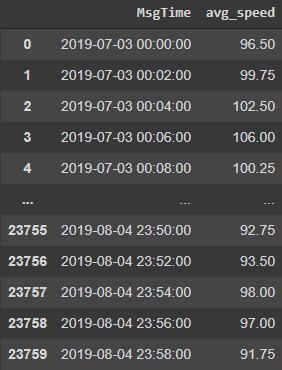
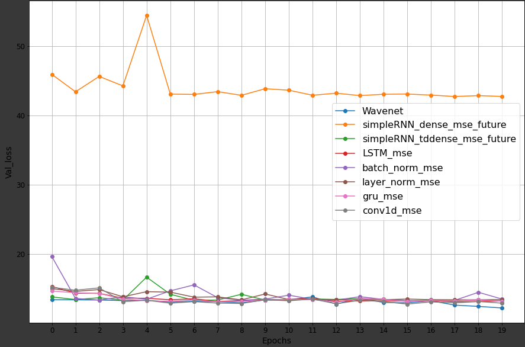
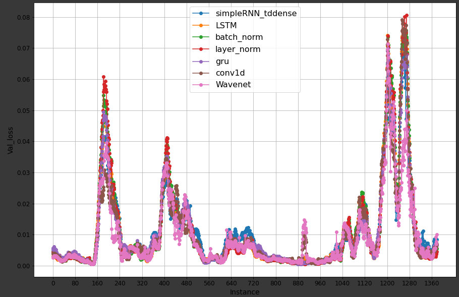
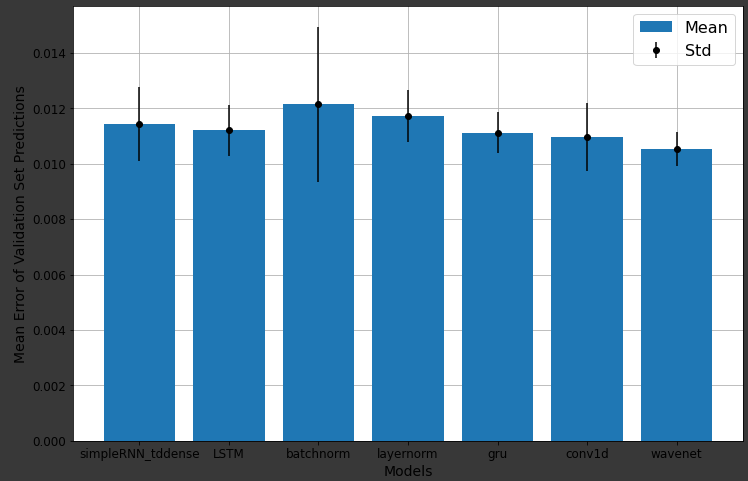
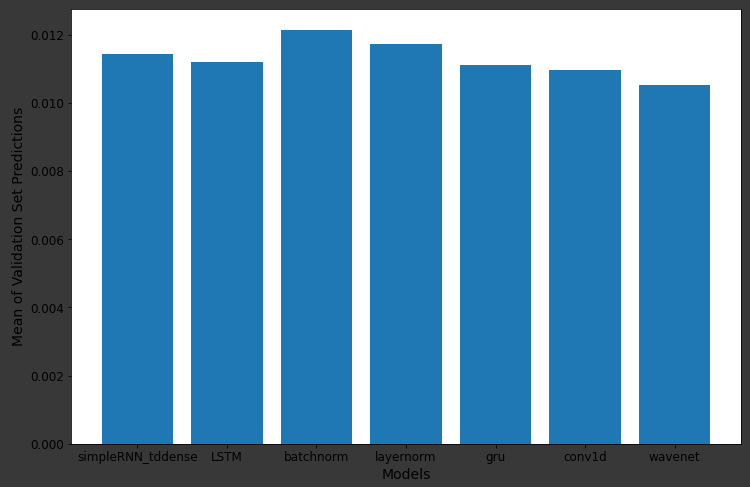
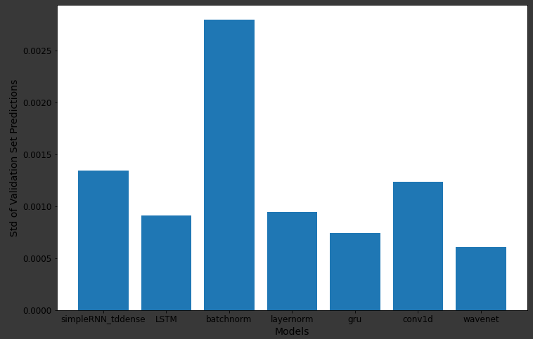

# Istanbul-Traffic-Forecasting-Model-Comparisons
 Compared different forecasting models on Istanbul traffic speed dataset that has been collected from the traffic sensors around the city with 2 minute intervals.

## Dataset
 The dataset has 28 columns, one of them is the time and the others are the data sent by the traffic sensors for each lane for both ways with intervals of 2 minutes each. The row count is 366213 with all the sensors combined. In this project I just choose one specific sensor and used that sensors data that has 23760 rows. To find the average speed I created another dataframe and put the average speed in each row. The training data image is given down below.

## Models
 The used models are BasicRNNs, LSTMs, using SimpleRNNs with Time-distributed layer’s, DeepRNNs with Batch and Layer Normalization, GRUs, 1D Concultional models and lastly WaveNet.

## Training and Testing
 Spliting the data to train, test and validation and training the models mentioned above with the training set. After the model training testing and validation the models and determining the best model for predicting the average speed of a designated place at a designated time. 

## Validation Loss vs Epoch Per Model

## Validation Loss vs Instance 

## Mean Error of the Validation Set Predictions

## Mean of Validation Set Predictions

## Standard Deviation of Validation Set Predictions 

## Conclusion
 After the models and comparisons the Wavenet model that have been built by with 1D Convolution layers with 8 hidden layers that have the dilation rates of 1-2-4-8-1-2-4-8 in order and one output layer was the best one for short term predictions. And most of the models are not reliable for long term predictions for now. 
